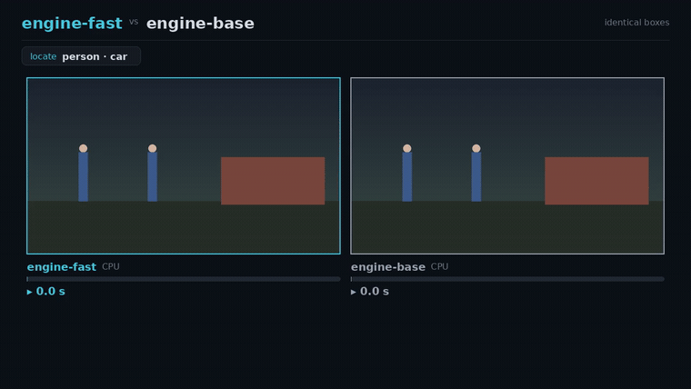

# image_race — render an IMAGE animation from frames (no recorder needed)

The rest of this repo *captures* a live terminal or GUI into a video. This recipe is
the other way round: it **composes each frame itself with Pillow** and stitches them
with ffmpeg. Reach for it when your content is **images** — annotated detections,
before/after, two models labeling the same photo — which a terminal recorder can't show.

Think of it as the moving-picture sibling of [`render-card.sh`](../../README.md#still-images-html--png-cards):
that turns HTML into a still PNG; this turns a frame function into an MP4/GIF.



The sample is a two-pane **detection race**: the same image side by side, the boxes
popping in over each engine's REAL measured time, the faster one filling first and
getting a ★, both ending on the identical boxes + a summary card. It also shows the
**query** that was asked (the detection prompt) in a search pill.

## Run

```sh
python3 image_race.py                      # synthetic scene, 16:9, writes out/image_race.mp4
python3 image_race.py --gif                # also write a .gif
python3 image_race.py --layout square      # 1:1 (stacked) for social
python3 image_race.py --layout vertical    # 9:16 (reels / stories)
python3 image_race.py --spec my.json --out out/my.mp4 --gif
```

No image, no Docker, no Xvfb — just Pillow + ffmpeg. If the spec has no `image` (or it's
missing) a synthetic stand-in scene is drawn, so it runs with zero assets.

## Spec

All fields optional except `engines` and `boxes`:

```json
{
  "image": "scene.png",            // omit -> a synthetic scene is drawn
  "img_w": 644, "img_h": 448,      // coordinate space the boxes are in (default: image size)
  "query": "person · car",         // shown in a 'locate' search pill (optional)
  "note": "identical boxes",       // header eyebrow + end-card title
  "link": "github.com/you/tool",
  "boxes": [["person", [x1,y1,x2,y2]], ["car", [x1,y1,x2,y2]]],
  "engines": [
    {"label": "engine-fast", "device": "CPU", "proc_s": 22.3, "rate": "11.6 tok/s", "accent": "teal"},
    {"label": "engine-base", "device": "CPU", "proc_s": 69.1, "rate": "3.7 tok/s",  "accent": "slate"}
  ]
}
```

`engines[0]` is the hero (teal). The fastest (lowest `proc_s`) gets the ★. `accent` is a
named palette entry (`teal`, `slate`, `amber`, `green`, `violet`, `rose`) or `[r,g,b]`.
Box colors are auto-assigned per label, so any labels work.

## The honest-timing rule

The seconds drawn on screen are the **real measured `proc_s`**; `--dilate` only sets
PLAYBACK speed (default: auto-fit the race to ~11 s). So a 111 s vs 36 s race is
watchable in a few seconds without faking the numbers — same principle as the
[`duel`](../duel) recipe.

## Branding outro

Append the shared branding outro (host ffmpeg, no Docker):

```sh
OW=1280 OH=720 TITLE="made with locate-anything.cpp" LOGO=../batch_demo/localai_logo.png \
  ../duel/outro.sh out/image_race.mp4 out/image_race_final.mp4
```

`make.sh` wires all of this together (renders the three layouts + appends the outro).
A real consumer: the locate-anything.cpp detection race in its `benchmarks/`.
